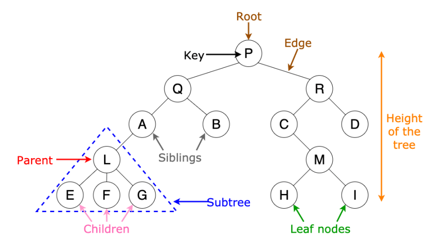
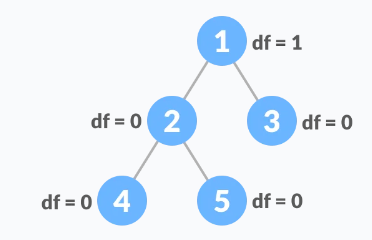

# Binary-trees

## 1-Definition

Binary trees are hierarchical data structures, and a binary tree is a data tree in which each node has a maximum of two child nodes, which are called the right son and the left son.

The top node in the data tree is called the root, the elements that branch from one element are called children, the element above another element is called the parent element, and the elements that do not have children are called leaves.



## 2-Applications that use data trees

Data trees are used to store information in a hierarchical fashion, like a computer's file system.
There are other applications of data trees, including:<br>
1-Data trees (with some arrangement like binary data trees) allow medium-speed accesses and searches (faster than linked lists and slower than arrays).<br>
2-Data trees allow medium-speed insertions and deletions (faster than arrays and slower than unordered linked lists).<br>
3-B-Tree and B+ Tree are used to perform indexing in databases.<br>

## 3-Binary data tree

### 3-1-Definition

A tree in which each element has at most two sons is called a Binary Tree, and since each element has only two sons, it can be called the right son and the left son.

### 3-2-Binary data tree representation

The binary data tree is represented by a pointer to the top node in the data tree. If the tree is empty, the root value is NULL.

The node includes the following parts:<br>
-data.<br>
-Pointer to the left node.<br>
-Pointer to the right node.<br>
<strong>Representation in java :</strong>

```
class Node
{
    int key;
    Node left, right;

    public Node(int item)
    {
        key = item;
        left = right = null;
    }
}
```

### Create a simple binary data tree

```
      tree
      ----
       1    <-- root
     /   \
    2     3
   /
  4
```

Java :

```
// 1-Node
class Node
{
    int key;
    Node left, right;

    public Node(int item)
    {
        key = item;
        left = right = null;
    }
}
public class BinaryTree {

    // 2-Binary tree root
    Node root;

    // 3-Constructors
    BinaryTree(int key)
    {
        root = new Node(key);
    }

    BinaryTree()
    {
        root = null;
    }

    public static void main(String[] args) {
        BinaryTree tree = new BinaryTree();

        /* 4-Create root*/
        tree.root = new Node(1);
        /* After executing the previous statement, the tree will look like this:
			 1
			/ \
		null   null
		*/

        tree.root.left = new Node(2);
        tree.root.right = new Node(3);
		/* 5-Node 2 and 3 become the left and right sons of Node 1
			 1
			/ \
		   2   3
		  / \ / \
		null null null null */

        tree.root.left.left = new Node(4);
        /* 6-Node 4 becomes the left son of Node 2
			 1
			/ \
		   2   3
		  / \ / \
		4  null null null */

    }
}

```

### 3-3-Properties of binary data trees

1- The maximum number of nodes at any level 'l' in the binary data tree is 2^(l-1)

Remark : the root is at level 1.

This rule can be proven in the following way:
l = 1 in the root, so the number of nodes is 2^(1-1) = 1

Remark : If we assume that the maximum number of nodes at level l is
2^(l-1), and since each node in the binary data tree has only two child nodes, then the next level of this node will have twice the number of nodes, ie 2\*2^(l-1).

2- The maximum number of nodes in a binary data tree with height 'h' is
2^(h-1)

The height of the tree is the maximum number of nodes from the root to the leaf, and the height of a tree that has one node is 1.

Remark : Some books indicate that the root height is 0, so the previous formula would look like this: 2h+1-1.

3- The lowest possible height or the lowest number of levels in a binary data tree with N nodes is Log2(N+1)

Remark : If we consider the assumption that the leaf node has the height 0, then the previous formula will become: Log2(N+1) - 1.

4- A binary data tree containing L of leaves has at least Log2(L) + 1 levels

5- In a binary data tree in which each node has either 0 or 2 child nodes, the number of leaf nodes is always 1 greater than the number of nodes that have two child nodes.

### 3-4-Types of binary data trees

1-<strong>Full binary data tree : </strong> The binary data tree is full if each node has 0 or 2 child nodes. A full binary data tree can also be defined as a tree in which every node has two child nodes except for the leaf nodes.

```
Ex 1:
               18
           /       \
         15         30
        /  \        /  \
      40    50    100   40

Ex 2:
             18
           /    \
         15     20
        /  \
      40    50
    /   \
   30   50

Ex 3:
               18
            /     \
          40       30
                   /  \
                 100   40
```

The number of leaf nodes in a filled binary data tree is equal to the number of internal nodes plus one.<br>
Ex 1: 1(18) + 1(15) + 1(30) + 1 ==> 4 leafs

2-<strong>Complete Binary Data Tree :</strong> A binary data tree is considered complete if all levels in it are fully populated except for the last level, where most keys are to the left as far as possible.

```
Ex 1:
               18
           /       \
         15         30
        /  \        /  \
      40    50    100   40


Ex 2:
               18
           /       \
         15         30
        /  \        /  \
      40    50    100   40
     /  \   /
    8   7  9
```

2-<strong>Perfect Binary data trees :</strong> A binary data tree is considered complete if all inner nodes have two child nodes and all leaf nodes are on the same level.

```
Ex 1:
               18
           /       \
         15         30
        /  \        /  \
      40    50    100   40

Ex 2:
               18
           /       \
         15         30
```

A Perfect binary tree of height h contains 2^(h)-1 nodes.<br>

3-<strong>Balanced Binary Data Tree :</strong> also referred to as a height-balanced binary tree, is defined as a binary tree in which the height of the left and right subtree of any node differ by not more than 1.
<br>
Balanced binary data trees are a good performance choice for lookups, inserts, and deletes because their time complexity is O(Log n).<br>

3-<strong>Degenerate Binary Data Tree :</strong> A binary data tree in which each internal node has one child node is called a degenerate (sick) binary graph. This type of binary data tree performs parallel to linked lists.

```
      10
      /
    20
     \
     30
      \
      40
```

### 3-5-Inserting elements into binary data trees

Elements can be inserted into binary data trees by navigating the tree levels using a queue, if we find a node that has an empty left node we create a new key as a left node for this node, otherwise if we find a node that has an empty right node we create a new key as a right node for this node.

```
import java.util.LinkedList;
import java.util.Queue;

public class BinaryTree {
    // 1-A node in a binary tree has a key, a pointer to the left child node, and a pointer to the right child node
    static class Node {
        int key;
        Node left, right;

        Node(int key){
            this.key = key;
            left = null;
            right = null;
        }
    }

    static Node root;
    static Node temp = root;

    // 2-Navigate through the levels of the binary tree

    static void inorder(Node temp)
    {
        if (temp == null)
            return;

        inorder(temp.left);
        System.out.print(temp.key+" ");
        inorder(temp.right);
    }

    // 3-A function to insert an element into the binary tree
    static void insert(Node temp, int key)
    {
        Queue<Node> q = new LinkedList<Node>();
        q.add(temp);

        // 4-Navigate through the levels of the binary tree in search of an empty space
        while (!q.isEmpty()) {
            temp = q.peek();//5-get head element (the first element added)
            q.remove();//6-remove the first element added

            if (temp.left == null) {
                temp.left = new Node(key);
                break;
            } else
                q.add(temp.left);

            if (temp.right == null) {
                temp.right = new Node(key);
                break;
            } else
                q.add(temp.right);
        }
    }
    // 7-test the previous functions
    public static void main(String[] args) {
        root = new Node(10);
        root.left = new Node(11);
        root.left.left = new Node(7);
        root.right = new Node(9);
        root.right.left = new Node(15);
        root.right.right = new Node(8);

        System.out.print( "Inorder traversal before insertion:");
        inorder(root);

        /*
			 10
			/   \
		   11    9
		  / \   / \
		 7 null 15 8  */

        int key = 12;
        insert(root, key);

        /*
			 10
			/   \
		   11    9
		  / \   / \
		 7  12 15  8  */
        System.out.print("\nInorder traversal after insertion:");
        inorder(root);
    }
}

```

### 3-6-Navigate the binary data tree

Linear data structures (arrays, linked lists, queues, stacks) can be traversed in one logical way, but data trees differ in this respect in that they can be navigated through their elements in different ways.<br>

<strong>Depth First Traversal,It includes three modes:</strong><br>
1-Inorder (left, root, right)<br>
<br>

2-Preorder (root, left, right)<br>
<br>

3-Postorder (left, right, root)<br>
<br>

<strong>Breadth First Traversal:</strong> Also called Level Order Traversal, it starts with the root and then moves to neighboring nodes and starts the search process at the same level before moving to the next level.

<br>

### 3-6-1-Depth First Traversal : The time complexity of the three operations is O(n).

```
/* 1-A class that includes the left and right child nodes of this node as well as the value of the key */
class Node
{
    int key;
    Node left, right;

    public Node(int item)
    {
        key = item;
        left = right = null;
    }
}
public class BinaryTree {

    // 2-root
    Node root;

    BinaryTree()
    {
        root = null;
    }

    // 3-Postorder
    void printPostorder(Node node)
    {
        if (node == null)
            return;

        // first recur on left subtree
        printPostorder(node.left);

        // then recur on right subtree
        printPostorder(node.right);

        // now deal with the node
        System.out.print(node.key + " ");
    }

    // 4-Inorder
    void printInorder(Node node)
    {
        if (node == null)
            return;

        printInorder(node.left);

        System.out.print(node.key + " ");

        printInorder(node.right);
    }

    // 5-Preorder
    void printPreorder(Node node)
    {
        if (node == null)
            return;

        System.out.print(node.key + " ");

        printPreorder(node.left);

        printPreorder(node.right);
    }

    // 6-simplification
    void printPostorder() {	 printPostorder(root); }
    void printInorder() {	 printInorder(root); }
    void printPreorder() {	 printPreorder(root); }

    // 7-test the previous functions
    public static void main(String[] args) {
        BinaryTree tree = new BinaryTree();
        tree.root = new Node(1);
        tree.root.left = new Node(2);
        tree.root.right = new Node(3);
        tree.root.left.left = new Node(4);
        tree.root.left.right = new Node(5);

        System.out.println("Preorder traversal of binary tree is ");
        tree.printPreorder();

        System.out.println("\nInorder traversal of binary tree is ");
        tree.printInorder();

        System.out.println("\nPostorder traversal of binary tree is ");
        tree.printPostorder();
    }
}
```

### 3-6-2-Navigate by width first

The rendering process can first be done in two ways:

<strong>Method 1: Use a function to print a specific level</strong><br>
This method includes two functions, the first is to print all nodes at a certain level (printGivenLevel) and the second is to print the navigation level in the tree (printLevelorder). The printLevelorder function makes use of the printGivenLevel function to print nodes at all levels one by one starting at the root.

```
/* 1-A class containing the left and right child of the current node and a key value */
class Node
{
    int data;
    Node left, right;
    public Node(int item)
    {
        data = item;
        left = right = null;
    }
}
public class BinaryTree {

    // 2-root of the binary tree
    Node root;

    public BinaryTree()
    {
        root = null;
    }

    /* 3-Function to print the result of navigating through tree levels */
    void printLevelOrder()
    {
        int h = height(root);
        int i;
        for (i=1; i<=h; i++)
            printGivenLevel(root, i);
    }

    /* 4-The function calculates the height of the tree
    The height of the tree is the longest path from the root node down to the farthest leaf node
     */
    int height(Node root)
    {
        if (root == null)
            return 0;
        else
        {
            /* 5-Calculate the height of each subtree */
            int lheight = height(root.left);
            int rheight = height(root.right);

            /* 6-Use the highest height */
            if (lheight > rheight)
                return(lheight+1);
            else return(rheight+1);
        }
    }

    /* 7-Print nodes at a specific level */
    void printGivenLevel (Node root ,int level)
    {
        if (root == null)
            return;
        if (level == 1)
            System.out.print(root.data + " ");
        else if (level > 1)
        {
            printGivenLevel(root.left, level-1);
            printGivenLevel(root.right, level-1);
        }
    }
    /* 8-Test the previous functions */
    public static void main(String args[])
    {
        BinaryTree tree = new BinaryTree();
        tree.root= new Node(1);
        tree.root.left= new Node(2);
        tree.root.right= new Node(3);
        tree.root.left.left= new Node(4);
        tree.root.left.right= new Node(5);

        System.out.println("Level order traversal of binary tree is ");
        tree.printLevelOrder();
    }

}
```
